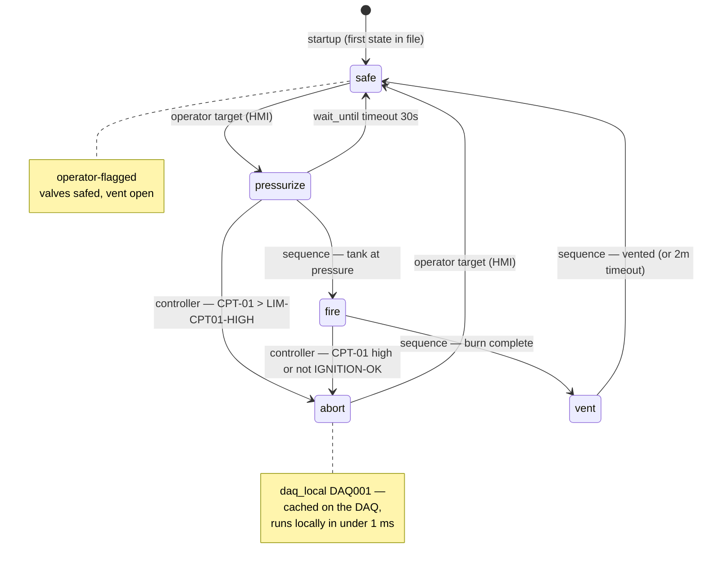

# Demo walkthrough: `coldflow.sm`

How the new engine executes the demo machine in `coldflow.sm`.

## State diagram



Solid arrows from `controller` lines fire on **any engine tick**; arrows from
`sequence` lines fire when that line of the entry script is reached.

## How the engine runs it

**Every engine tick** (default 100 Hz, `engineTickRateHz` in system.yaml):

1. Computed `.chan` channels refresh (e.g. `PT-FUEL-AVG = (PT-01 + PT-02) / 2`).
2. The active state's `controller` block runs top to bottom. In `fire`, that means the
   two abort guards are re-checked 100×/second the whole burn.
3. `.alert` rules evaluate.

**On state entry**, the `sequence` block starts once, in its own goroutine. It may
`sleep`, `wait_until`, assign channels (which become `cmd` messages to the daqNode),
and `transition`. A `transition` from *anywhere* (controller, sequence, operator)
cancels the running sequence immediately — so if `controller` aborts mid-burn, the
`sleep SEQ-BURN-DUR` never finishes.

**Operator interaction:** the machine auto-publishes two soft channels —
`SM-COLDFLOW-STATE` (current state name, drives the HMI display) and
`SM-COLDFLOW-TARGET` (HMI writes a state name here). Only `operator`-flagged states
(`safe`, `pressurize`) are valid targets; commanding `fire` directly is rejected —
it's only reachable through `pressurize`'s sequence.

**A nominal run:**

| Step | What happens |
|---|---|
| startup | machine enters `safe`; sequence safes both valves, opens vent |
| operator → `pressurize` | vent closes, `OV-05` opens; sequence parks on `wait_until` tank pressure ≥ `SEQ-TARGET-PRESS` (30 s timeout falls back to `safe`) |
| pressure reached | sequence transitions to `fire`: `FV-02` opens, burns for `SEQ-BURN-DUR` ms while the controller re-checks abort guards every tick |
| burn done | `fire` → `vent`: main valve closed, vent opened, waits for pressure < 50 |
| vented | back to `safe`, ready for the next run |

**Off-nominal:** if `CPT-01` exceeds `LIM-CPT01-HIGH` during `pressurize` or `fire`,
the controller transitions to `abort` on that tick (≤ 10 ms reaction at 100 Hz).

## The `daq_local` abort

Network latency is too slow for T-0 aborts, so `abort` is flagged `daq_local DAQ001`.
At compile time its sequence — restricted to literal assignments and sleeps — is
serialized into the **existing** DAQ payload format. The payload is resolved and sent
when the engine *enters* the state (`state_update` means "enter this state now"), and
re-sent on a node `state_req`:

```json
{
  "type": "state_update",
  "state": "abort",
  "runId": 0,
  "entry_sequence": [
    { "t_ms": 0,   "refDes": "FV-02-CMD", "value": 0 },
    { "t_ms": 0,   "refDes": "OV-05-CMD", "value": 0 },
    { "t_ms": 100, "refDes": "VENT-CMD",  "value": 1 }
  ],
  "exit_sequence": [
    { "t_ms": 0,   "refDes": "FV-02-CMD", "value": 0 },
    { "t_ms": 0,   "refDes": "OV-05-CMD", "value": 0 },
    { "t_ms": 0,   "refDes": "VENT-CMD",  "value": 1 }
  ],
  "abort_rules": [
    { "if": "CPT-01 > 850", "t_ms_on": 0, "t_ms_off": 20000 }
  ]
}
```

That JSON is the golden fixture in `statemachine/daqlocal_test.go`
(`TestDaqLocal_AbortGolden`) — the test compiles `coldflow.sm` and compares the
resolved payload against it, so this block cannot drift from the real output.

Three fields carry the lifecycle:

- **`runId`** — a monotonic id stamped on every send (`0` here because the golden
  fixture resolves the payload directly rather than entering the state). A node
  that echoes it back on `sequence_complete` lets the engine discard a completion
  that belongs to a superseded run.
- **`exit_sequence`** — the `abort_sequence` block, compiled the same way as the
  entry sequence. The node runs it locally, in under a millisecond, the moment an
  `abort_rule` trips; nothing waits for the control node.
- The abort destination is *not* in the payload — it is the trailing
  `transition safe` of `abort_sequence`, kept control-node side. When the node
  reports `abort_triggered`, the engine moves the machine there.

So the abort fires two ways: the controlnode's controller guard (any-state, rich
expressions, ~10 ms), and the DAQ's local rule (`abort_rule` line, < 1 ms, survives a
network drop). Both land in the same `abort` state.

## Feature coverage checklist

| Spec feature | Where in the demo |
|---|---|
| initial state = first in file | `safe` |
| `operator` flag / rejected targets | `safe`, `pressurize` vs `fire` |
| `controller` per-tick guards | `pressurize`, `fire` |
| `sequence` with sleep/wait_until/transition | all states |
| `wait_until … timeout … -> state` | `pressurize`, `vent` |
| duration from a channel | `sleep SEQ-BURN-DUR` |
| computed-channel reference | `PT-FUEL-AVG`, `IGNITION-OK` |
| hyphenated identifiers | every refDes |
| `not` / boolean logic | `if not IGNITION-OK` |
| `daq_local` + `abort_rule` | `abort` |
| `abort_sequence` + abort destination | `abort` (`transition safe`) |
| resting state (no transition) | `safe` |
